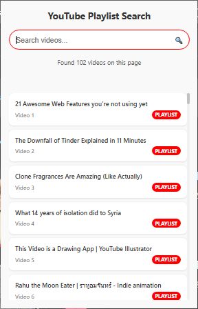

# 🎬 Video Finder Chrome Extension

A lightweight Chrome extension that **instantly finds and searches all videos** on any webpage.  
Perfect for discovering videos across **any website** — social media, news sites, educational platforms, and more.

---

## ✨ Features
- ⚡ **Instant Detection** – Automatically finds all videos on any webpage in seconds.  
- 🔍 **Real-time Search** – Filter videos by title with live keyword matching.  
- 🎯 **Multiple Video Types** – Detects HTML5 videos, embedded content (YouTube, Vimeo), and video links.  
- 🖥 **Clean Interface** – Minimalist popup design that shows video count and search results.  
- 📱 **Universal Support** – Works on any website with video content.  
- 🔗 **Direct Access** – Click any result to open the video directly.  
- 🚫 **No External APIs** – Runs entirely in your browser, no data sent anywhere.  

---

## Screenshots

<table align="center">
  <tr>
    <td align="center" width="45%">
      <br>
      
    </td>
    <td align="center" width="45%">
      
    </td>
  </tr>
</table>


---

## 🎯 How It Works

The extension scans the current webpage for:
- **HTML5 Video Elements** (`<video>` tags)
- **Embedded Videos** (YouTube, Vimeo, Dailymotion iframes)
- **Video Links** (`.mp4`, `.webm`, `.ogg`, `.avi`, `.mov` files)

---

## 🚀 Installation

### From Source (Developer Mode)

1. **Download the extension:**
   ```bash
   git clone https://github.com/yourusername/video-finder-extension.git
   cd video-finder-extension
   ```

2. **Load in Chrome:**
   - Open Chrome and go to [`chrome://extensions/`](chrome://extensions/)
   - Enable **Developer mode** (toggle in top-right)
   - Click **Load unpacked**
   - Select the project folder

3. **Pin the extension:**
   - Click the puzzle piece icon in Chrome toolbar
   - Pin the Video Finder extension for easy access

---

## 🎬 Usage

1. **Navigate to any webpage** with videos (news sites, social media, blogs, etc.)

2. **Click the extension icon** in your toolbar

3. **Wait for detection** – The extension automatically scans for all videos

4. **Search (optional)** – Type keywords to filter videos by title

5. **Click any result** to open/focus the video

### 📋 Example Use Cases
- Find all videos on a news article page
- Discover embedded content on social media posts
- Locate video tutorials scattered across a website
- Extract video links from forum posts or blogs

---

## 📁 Project Structure

```
video-finder-extension/
├── manifest.json          # Extension configuration
├── popup.html            # Extension popup interface
├── popup.js              # Main popup logic with messaging
├── content.js            # Content script for video detection
├── popup.css            # Styling for the popup
└── icons/               # Extension icons
    ├── icon16.png
    ├── icon48.png
    └── icon128.png
```

---

## 🛠 Technical Details

### Permissions Required
- `activeTab` - Access current webpage content
- `scripting` - Inject content scripts to find videos
- `host_permissions` - Work on http/https websites

### Supported Video Types
- **HTML5 Videos:** Native `<video>` elements
- **Embedded:** YouTube, Vimeo, Dailymotion iframes
- **Direct Links:** Common video file formats

### Browser Compatibility
- Chrome 88+
- Uses Manifest V3 for future compatibility

---

## 🛣 Roadmap

Planned improvements to make video discovery even better:

- [ ] **Optimization** – Optimize the extension for slower machines 
- [ ] **Video Thumbnails** – Show preview images in search results
- [ ] **Duration Display** – Show video length when available
- [ ] **Advanced Filters** – Filter by video type, duration, or source
- [ ] **Bulk Actions** – Download or bookmark multiple videos at once
- [ ] **Video Metadata** – Display resolution, codec, and file size info
- [ ] **Custom Shortcuts** – Keyboard shortcuts for quick access
- [ ] **Export Results** – Save video lists as JSON/CSV
- [ ] **History Tracking** – Remember previously found videos
- [ ] **Dark Mode** – Theme toggle for better user experience

---

## 🔧 Development

### Local Setup
```bash
# Clone the repository
git clone https://github.com/yourusername/video-finder-extension.git
cd video-finder-extension

# Make changes to the code
# Reload the extension in chrome://extensions/ to test
```

### Key Files to Modify
- **`popup.js`** – Main extension logic and UI interactions
- **`content.js`** – Video detection algorithms
- **`popup.html`** – User interface structure
- **`popup.css`** – Styling and appearance

---

## 🐛 Troubleshooting

### Common Issues

**"No videos found on this page"**
- The page might not have detectable video content
- Try refreshing the page and running the extension again
- Some videos may be loaded dynamically after page load

**"Failed to communicate with page content"**
- Cannot access chrome:// or extension pages
- Some websites block content scripts
- Try on a different website to verify the extension works

**Extension not loading**
- Ensure you're using Chrome 88+
- Check that Developer Mode is enabled
- Verify all files are present in the extension folder

---

## 🤝 Contributing

Contributions are welcome! Here's how you can help:

1. **Fork the repository**
2. **Create a feature branch:** `git checkout -b feature-name`
3. **Make your changes** and test thoroughly
4. **Submit a pull request** with a clear description

### Ideas for Contributors
- Add support for more video platforms
- Improve video title detection algorithms
- Create better error handling and user feedback
- Add internationalization support

---

## 📜 License

This project is licensed under the **MIT License** – see the [LICENSE](LICENSE) file for details.

---

## ⭐ Support

If you find this extension useful:
- ⭐ **Star the repository** on GitHub
- 🐛 **Report bugs** via GitHub Issues
- 💡 **Suggest features** for future updates
- 🔄 **Share with others** who might find it helpful

---

<p align="center">
  <strong>Happy video hunting! 🎬</strong>
</p>
